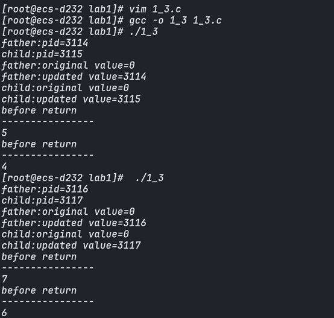

# 操作系统实验报告

# 实验一 进程、线程相关编程经验

# 1.1 进程相关编程实验

##  实验步骤

本实验通过在程序中输出父、子进程的 pid，分析父子进程 pid 之间的关系，进一步加入 wait()函数分析其作用。

步骤一： 编写并多次运行图 1-1 中代码


可以看到，始终是先打印子进程，再打印父进程。

步骤二： 删去图 1-1 代码中的 wait()函数并多次运行程序，分析运行结果。


可以发现当前情况下存在child有可能先于parent进程运行。

原因在于wait会阻塞父进程的执行知道子进程执行完成。去除之后，父子进程并发执行，打印顺序将不确定，并会出现僵尸进程。

可以将父进程先结束，打印子进程的ppid实验如下


可以看到，父进程结束后，子进程的ppid变成了1，即init进程。由init进程接管。

步骤三： 修改图 1-1 中代码，增加一个全局变量并在父子进程中对其进行不同的操作，观察并解释所做操作和输出结果。

```c
#include<sys/wait.h>
#include<sys/types.h>
#include<stdio.h>
#include<unistd.h>

int value=0;
int main(){
    pid_t pid,pidi;
    /*fork a child process*/
    pid = fork();
    if(pid<0){
        fprintf(stderr, "Fork Failed");
        return 1;
    }
    else if(pid==0){
        printf("child:pid=%d\n",getpid());
        sleep(2);
        printf("child:original value=%d\n",value);
        value=getpid();
        printf("child:updated value=%d\n",value);
    }
    else{
        printf("father:pid=%d\n",getpid());
        printf("father:original value=%d\n",value);
        value=getpid();
        printf("father:updated value=%d\n",value);
        wait(NULL);
    }
    return 0;
}
```

我定义了一个全局变量value，在每个进程中，先输出原始值，在输出更改后的值，对value的更改都是将他设置为当前进程的PID。

运行结果


父进程与子进程先后交替运行，是合理的。并且通过分析，父子进程的value各自拥有一个独立的副本，每个进程对value的修改是独立的。

在程序中打印value的地址

```c
#include<sys/wait.h>
#include<sys/types.h>
#include<stdio.h>
#include<unistd.h>

int value=0;
int main(){
	pid_t pid,pid1;
	/*fork a child process*/
	pid = fork();
	if(pid<0){
		fprintf(stderr,"Fork Failed");
		return 1;
	}
	else if(pid==0){
		printf("child:pid=%d\n",getpid());
		sleep(2);
		printf("child:original value=%d\n",value);
		value=getpid();
		printf("child:updated value=%d\n",value);
		//打印value地址
		printf("child:value address=%p\n",&value);	
	}

	else{
		printf("father:pid=%d\n",getpid());
		printf("father:original value=%d\n",value);
		value=getpid();
		printf("father:updated value=%d\n",value);
		//打印value地址
		printf("father:value address=%p\n",&value);
		wait(NULL);
	}
	return 0;
}
```

运行结果


从这个结果，可以更好的理解操作系统的内存机制。
第一，每次运行时，父子进程的value地址是相同的，这是因为在fork时，父子进程共享页表，因此地址是一样的,value的独立副本是它们采取写时复制机制，当需要对某个地址空间的值做修改时，会使该页表指向新的物理帧。

第二，每次运行value的虚拟地址空间都是不变的，这是因为代码在编译链接阶段就已经确定好了变量的虚拟地址。


步骤四： 在步骤三基础上，在 return 前增加对全局变量的操作（自行设计）并输出结果，观察并解释所做操作和输出结果



进行的操作是对10取余，再次印证了value是独立的副本。

步骤五： 修改图 1-1 程序，在子进程中调用 system()与 exec 族函数。 编写system_call.c 文件输出进程号 PID，编译后生成 system_call 可执行文件。在子进程中调用 system_call,观察输出结果并分析总结。

system.c源码

```c
#include<sys/types.h>
#include<stdio.h>
#include<unistd.h>
int main(){
    printf("hello,I'm the result of calling system or exec");
    printf("\n");
    printf("my pid is %d\n",getpid());
}
```

调用system的源码
```c
#include<sys/types.h>
#include<stdio.h>
#include<unistd.h>
#include<stdlib.h>

int main(){
    /*fork a child process*/
    pid_t pid=fork();
    if(pid<0){
        fprintf(stderr,"Fork Failed");
        return 1;
    }
    else if(pid==0){
        printf("child:pid=%d\n",getpid());/*A*/
        int ret=system("./test");
        printf("system call is end,the return value is %d\n",ret);
    }
    else{
        printf("parent:pid=%d\n",getpid());/*C*/
        wait(NULL);
    }
    return 0;
}
```

运行结果


可以看到system会新建一个进程。

调用exec族函数源代码
```c
#include<sys/types.h>
#include<stdio.h>
#include<unistd.h>
#include<stdlib.h>

int main(){
    /*fork a child process*/
    pid_t pid=fork();
    if(pid<0){
        fprintf(stderr,"Fork Failed");
        return 1;
    }
    else if(pid==0){
        printf("child:pid=%d\n",getpid());/*A*/
        if(execl("/root/code_field/c_code/oslab/lab1/test","test",NULL)==-1){
            printf("execl failed\n");
        }
        printf("if execl succeed,this will not be executed\n");
    }
    else{
        printf("parent:pid=%d\n",getpid());/*C*/
        wait(NULL);
    }
    return 0;
}
```
运行结果


这样的结果并不好分析，子进程并没有输出pid，代码稍作修改

```c
#include<sys/types.h>
#include<stdio.h>
#include<unistd.h>
#include<stdlib.h>

int main(){
    /*fork a child process*/
    pid_t pid=fork();
    if(pid<0){
        fprintf(stderr,"Fork Failed");
        return 1;
    }
    else if(pid==0){
        printf("child:pid=%d\n",getpid());/*A*/
        fflush(stdout);
        if(execl("/root/code_field/c_code/oslab/lab1/test","test",NULL)==-1){
            printf("execl failed\n");
        }
        printf("if execl succeed,this will not be executed\n");
    }
    else{
        printf("parent:pid=%d\n",getpid());/*C*/
        wait(NULL);
    }
    return 0;
}
```
运行结果


### **使用 `system()` 调用**

1. **父进程PID：** 父进程的有一个PID。这是该进程的唯一标识符。
2. **子进程PID：** 子进程通过 **`system()`** 调用 **`system_call`** 执行文件时，生成了一个新的进程，该新进程也有一个PID。

### **使用 `exec()` 调用**

1. **子进程替换：** 通过对旧代码的分析,**`exec()`** 函数替换了子进程的内容,这也就导致了printf没有输出出来。这个PID与父进程中显示的子进程PID一致。
2. **程序流：** 由于 **`exec()`** 替换了子进程的内容，**`exec()`** 之后的任何代码都不会被执行,在运行结果中也可以看到exec后的一行printf并没有执行。

### **总结**

1. **进程独立性：** 使用 **`system()`** 创建了一个全新的进程来执行 **`system_call`**，而父进程和子进程都继续执行了剩下的代码。
2. **进程替换：** 使用 **`exec()`** 替换了子进程的内容，所以新的 **`system_call`** 运行在原子进程的上下文中，而没有创建新的进程。
3. **控制流：** 两种方法都在子进程中成功调用了 **`system_call`**，但 **`system()`** 允许子进程继续执行其他代码，而 **`exec()`** 则完全替换了子进程，使得 **`exec()`** 之后的代码不会被执行。

## 1.1.2实验总结

### 1.1.2.1 实验中的问题与解决过程

1. **问题：system() 和 exec() 的用法**
    - **描述：** 在尝试在子进程中调用 **`system()`** 和 **`exec()`** 函数时，初次遇到一些困惑和不熟悉的用法。
    - **解决：** 通过查阅文档和测试，理解了这两个函数的基本用法和作用，并成功地在代码中应用了它们。

### 1.1.2.2 实验收获

1. **进程管理理解深化**：通过这个实验，更加深入地了解了 Linux 系统中进程的创建、管理和调度。特别是通过观察 **`wait()`** 函数的行为，理解了父子进程间同步的重要性。
2. **编程技巧提升**：这个实验让我更熟悉了 C 语言的编程模式，尤其是涉及到系统级调用和进程管理的函数。对 **`fork()`**, **`wait()`**, **`system()`**, 和 **`exec()`** 等函数有了更深入的了解。
3. **系统调用与命令行工具**：实验中涉及到 **`system()`** 和 **`exec()`** 系列函数，使我了解了如何在程序中执行系统命令，以及如何用 **`exec()`** 替换当前进程的执行内容。
4. **多进程编程模型**：通过在一个程序中创建多个进程，以及管理这些进程的行为和状态，我对多进程编程有了更实际的认识和理解。

# 1.2 线程相关编程实验

## 实验步骤

步骤一： 设计程序，创建两个子线程， 两线程分别对同一个共享变量多次操作，观察输出结果。

源代码如下：
```c
#include<stdio.h>
#include<pthread.h>

int res=0;

void *add(void *target){
    for(int i=0;i<100000;i++){
        res+=100;
    }
}

void *minus(void *target){
    for(int i=0;i<100000;i++){
        res-=100;
    }
}

int main(){
    pthread_t thread1,thread2;
    if(pthread_create(&thread1,NULL,add,&res)==0){
        printf("Thread 1 created\n");
    }
    if(pthread_create(&thread2,NULL,minus,&res)==0){
        printf("Thread 2 created\n");
    }
    pthread_join(thread1,NULL);
    pthread_join(thread2,NULL);
    printf("%d\n",res);
    return 0;
}
```

运行结果


可以发现，此时输出的结果并不并不固定。这是因为两个线程并发执行，对共享变量res读取到寄存器中时，读取到的是同一个值，一个线程要+100，一个线程要-100，本来效果应该是相互抵消的，但写回内存时，只将自己操作后的结果写回内存，此时就表现出+100或-100，导致值的改变。

考虑一个简单的情境：

1. **res** 当前值为 0。
2. 线程1 读取其值（0），准备加1。
3. 线程2 被调度，读取其值（还是0），准备减1。
4. 线程1 继续执行，将值加1，结果为1。
5. 线程2 继续执行，减1（认为之前的值是0），结果为 -1。

步骤二： 修改程序， 定义信号量 signal，使用 PV 操作实现共享变量的访问与互斥。运行程序，观察最终共享变量的值。

同步（Synchronization）在多线程编程中指的是协调多个线程的执行，以确保它们能够正常、可预测地访问共享资源或完成某些任务。互斥（Mutual Exclusion）是同步的一种特殊形式，确保一次只有一个线程能访问某个特定的资源或代码段。互斥通常通过互斥锁（Mutex）来实现，但它也可以通过其他机制来实现，比如信号量（Semaphore）。信号量和互斥锁类似，但更为通用。信号量可以用来解决除了互斥之外的其他同步问题。

PV操作是信号量（Semaphores）操作的传统术语，源自荷兰语的Proberen（尝试）和Verhogen（增加）。在信号量的上下文中，P操作通常用于申请或等待资源，而V操作用于释放或发出信号。

**P操作（也叫`wait`或`down`或`sem_wait`）**

- 当一个线程执行P操作时，它会检查信号量的值。
    - 如果信号量的值大于0，那么它将减少信号量的值（通常是减1）并继续执行。
    - 如果信号量的值为0，线程将被阻塞，直到信号量的值变为大于0。

**V操作（也叫`signal`或`up`或`sem_post`）**

- V操作增加信号量的值（通常是加1）。
- 如果有线程因执行P操作而阻塞在这个信号量上，一个或多个线程将被解除阻塞，并被允许减少信号量的值。

在C语言中，使用POSIX信号量

- **`sem_wait(&semaphore);`**：执行P操作。
- **`sem_post(&semaphore);`**：执行V操作。

其中，**`semaphore`**是一个**`sem_t`**类型的变量，代表信号量。

**`sem_init`**和**`sem_destroy`**是POSIX信号量（Semaphores）的初始化和销毁函数，它们用于设置和清理信号量。

**`sem_init`**

这个函数用于初始化一个未命名的信号量。

```c
int sem_init(sem_t *sem, int pshared, unsigned int value);
```

- **sem**: 一个指向信号量对象的指针。
- **pshared**: 如果这个参数是0，信号量就是当前进程的局部信号量。如果这个参数非0，则该信号量在多个进程间共享。
- **value**: 信号量的初始值。

这个函数成功时返回0，失败时返回-1。

**`sem_destroy`**

这个函数用于销毁一个未命名的信号量，释放其占用的资源。

```c
int sem_destroy(sem_t *sem);
```

- **sem**: 一个指向信号量对象的指针。

这个函数成功时返回0，失败时返回-1。在使用**`sem_destroy`**之前，确保没有线程被阻塞在该信号量上。

整体的代码为：

```c
#include<stdio.h>
#include<pthread.h>
#include<semaphore.h>

int res=0;
sem_t sem;

void *add(void *target){
    for(int i=0;i<100000;i++){
        sem_wait(&sem);
        res+=100;
        sem_post(&sem);
    }
}

void *minus(void *target){
    for(int i=0;i<100000;i++){
        sem_wait(&sem);
        res-=100;
        sem_post(&sem);
    }
}

int main(){
    pthread_t thread1,thread2;
    sem_init(&sem, 0, 1); // 初始化信号量，初始值为1，用于互斥

    if(pthread_create(&thread1,NULL,add,&res)==0){
        printf("Thread 1 created\n");
    }
    if(pthread_create(&thread2,NULL,minus,&res)==0){
        printf("Thread 2 created\n");
    }
    pthread_join(thread1,NULL);
    pthread_join(thread2,NULL);
    printf("%d\n",res);
    
    sem_destroy(&sem); // 销毁信号量
    return 0;
}
```
运行结果


可以看到用信号量同步之后，结果就是正确的，可预测的。

步骤三： 在第一部分实验了解了 system()与 exec 族函数的基础上，将这两个函数的调用改为在线程中实现，输出进程 PID 和线程的 TID 进行分析。

system_call程序源码
```c
#include<stdio.h>
#include <unistd.h>
#include <sys/types.h>

int main(){
    printf("thread_system_call pid:%d\n",getpid());
}
```

调用system的函数源码
```c
#include<stdio.h>
#include<pthread.h>
#include<stdlib.h>
#include <sys/types.h>

void* system_call(void* arg){
    int num=*((int*)arg);
    printf("Thread%d created\n",num);
    printf("Thread%d TID:%d, PID:%d\n",num,pthread_self(),getpid());
    system("/root/code_field/c_code/oslab/lab1/thread_system_call");
}

int main(){
    pthread_t thread1,thread2;
    int arg1=1,arg2=2;
    if(pthread_create(&thread1,NULL,system_call,&arg1)!=0){
        printf("Thread 1 creation failed\n");
    }
    if(pthread_create(&thread2,NULL,system_call,&arg2)!=0){
        printf("Thread 2 creation failed\n");
    }
    pthread_join(thread1,NULL);
    pthread_join(thread2,NULL);
}
```
运行结果


结果显示线程的TID不同，但都有一个相同的PID，也就是父进程的PID。
每一个线程的system调用都会创建一个新进程

应用exec族函数源码


```c
#include<stdio.h>   
#include<pthread.h>
#include<unistd.h>
#include<sys/types.h>

void* exec_call(void* arg){
    int num=*((int*)arg);
    fprintf(stderr,"Thread%d created\n",num);
    fprintf(stderr,"Thread%d TID:%d,PID:%d\n",num,pthread_self(),getpid());
    execl("/root/code_field/c_code/oslab/lab1/exec_call","exec_call",NULL);
    printf("if execl fails,this line will be printed\n");
}

int main(){
    pthread_t thread1,thread2;   
    int arg1=1,arg2=2;
    if(pthread_create(&thread1,NULL,exec_call,&arg1)!=0){
        printf("Thread 1 creation failed\n");
    }
    if(pthread_create(&thread2,NULL,exec_call,&arg2)!=0){
        printf("Thread 2 creation failed\n");
    }
    pthread_join(thread1,NULL);
    pthread_join(thread2,NULL);
    printf("if exec succeed,this will no be prinrfed");
}
```
运行结果


结果分析，父线程的最后一行的printf并没有执行，并且exec只有的代码实际上只执行了一遍，这是因为exec的调用实际上是进程级别的，调用exec会导致整个进程的代码段被替换，而不仅仅是当前线程执行的函数。

# 1.3 自旋锁实验

## 实验步骤

步骤一： 根据实验内容要求，编写模拟自旋锁程序代码 spinlock.c， 待补充主函数的示例代码如下：

```c
#include <stdio.h>
#include <pthread.h>
// 定义自旋锁结构体

typedef struct {
    int flag;
}spinlock_t;
// 初始化自旋锁

void spinlock_init(spinlock_t *lock) {
    lock->flag = 0;
}

// 获取自旋锁
void spinlock_lock(spinlock_t *lock) {
    while (__sync_lock_test_and_set(&lock->flag, 1)) {
    // 自旋等待
    }
}

// 释放自旋锁
void spinlock_unlock(spinlock_t *lock) {
    __sync_lock_release(&lock->flag);
}
// 共享变量

int shared_value = 0;

// 线程函数

void *thread_function(void *arg) {
    spinlock_t *lock = (spinlock_t *)arg;
 
    for (int i = 0; i < 5000; ++i) {
        spinlock_lock(lock);
        shared_value++;
        spinlock_unlock(lock);
    }
 
    return NULL;
}
int main() {
    pthread_t thread1, thread2;
    spinlock_t lock;
// 输出共享变量的值
    printf("original shared_value: %d\n", shared_value);
// 初始化自旋锁
    spinlock_init(&lock);
// 创建两个线程
    if(pthread_create(&thread1, NULL, thread_function, (void *)&lock) != 0) {
        perror("Failed to create thread 1");
        return 1;
    }
    printf("Thread 1 created\n");
    if(pthread_create(&thread2, NULL, thread_function, (void *)&lock) != 0) {
        perror("Failed to create thread 2");
        return 1;
    }
    printf("Thread 2 created\n");
 
// 等待线程结束
    pthread_join(thread1, NULL);
    pthread_join(thread2, NULL);
// 输出共享变量的值
    printf("final shared_value: %d\n", shared_value);

    return 0;
}
```
运行结果


由于两个线程共用一个互斥锁，每次要对共享变量执行操作时，都要获取锁，因此保证了变量的安全更新。
