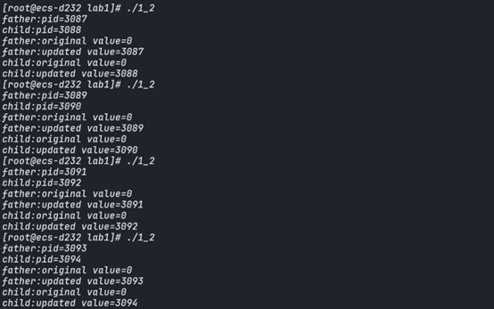

# 1.1 进程相关编程实验

##  实验步骤

本实验通过在程序中输出父、子进程的 pid，分析父子进程 pid 之间的关系，进一步加入 wait()函数分析其作用。

步骤一： 编写并多次运行图 1-1 中代码


可以看到，始终是先打印子进程，再打印父进程。

步骤二： 删去图 1-1 代码中的 wait()函数并多次运行程序，分析运行结果。


可以发现当前情况下存在child有可能先于parent进程运行。

原因在于wait会阻塞父进程的执行知道子进程执行完成。去除之后，父子进程并发执行，打印顺序将不确定，并会出现僵尸进程。

步骤三： 修改图 1-1 中代码，增加一个全局变量并在父子进程中对其进行不同的操作，观察并解释所做操作和输出结果。


```c
#include<sys/wait.h>
#include<sys/types.h>
#include<stdio.h>
#include<unistd.h>

int value=0;
int main(){
    pid_t pid,pidi;
    /*fork a child process*/
    pid = fork();
    if(pid<0){
        fprintf(stderr, "Fork Failed");
        return 1;
    }
    else if(pid==0){
        printf("child:pid=%d\n",getpid());
        sleep(2);
        printf("child:original value=%d\n",value);
        value=getpid();
        printf("child:updated value=%d\n",value);
    }
    else{
        printf("father:pid=%d\n",getpid());
        printf("father:original value=%d\n",value);
        value=getpid();
        printf("father:updated value=%d\n",value);
        wait(NULL);
    }
    return 0;
}
```

我定义了一个全局变量value，在每个进程中，先输出原始值，在输出更改后的值，对value的更改都是将他设置为当前进程的PID。

运行结果



父进程与子进程先后交替运行，是合理的。并且通过分析，父子进程的value各自拥有一个独立的副本，每个进程对value的修改是独立的。

步骤四： 在步骤三基础上，在 return 前增加对全局变量的操作（自行设计）并输出结果，观察并解释所做操作和输出结果


进行的操作是对10取余，再次印证了value是独立的副本。

步骤五： 修改图 1-1 程序，在子进程中调用 system()与 exec 族函数。 编写system_call.c 文件输出进程号 PID，编译后生成 system_call 可执行文件。在子进程中调用 system_call,观察输出结果并分析总结。

system.c源码

```c
#include<sys/types.h>
#include<stdio.h>
#include<unistd.h>
int main(){
    printf("hello,I'm the result of calling system or exec");
    printf("\n");
    printf("my pid is %d\n",getpid());
}
```

调用system的源码
```c
#include<sys/types.h>
#include<stdio.h>
#include<unistd.h>
#include<stdlib.h>

int main(){
    /*fork a child process*/
    pid_t pid=fork();
    if(pid<0){
        fprintf(stderr,"Fork Failed");
        return 1;
    }
    else if(pid==0){
        printf("child:pid=%d\n",getpid());/*A*/
        int ret=system("./test");
        printf("system call is end,the return value is %d\n",ret);
    }
    else{
        printf("parent:pid=%d\n",getpid());/*C*/
        wait(NULL);
    }
    return 0;
}
```

运行结果


可以看到system会新建一个进程。

调用exec族函数源代码
```c
#include<sys/types.h>
#include<stdio.h>
#include<unistd.h>
#include<stdlib.h>

int main(){
    /*fork a child process*/
    pid_t pid=fork();
    if(pid<0){
        fprintf(stderr,"Fork Failed");
        return 1;
    }
    else if(pid==0){
        printf("child:pid=%d\n",getpid());/*A*/
        if(execl("/root/code_field/c_code/oslab/lab1/test","test",NULL)==-1){
            printf("execl failed\n");
        }
        printf("if execl succeed,this will not be executed\n");
    }
    else{
        printf("parent:pid=%d\n",getpid());/*C*/
        wait(NULL);
    }
    return 0;
}
```
运行结果


这样的结果并不好分析，子进程并没有输出pid，代码稍作修改

```c
#include<sys/types.h>
#include<stdio.h>
#include<unistd.h>
#include<stdlib.h>

int main(){
    /*fork a child process*/
    pid_t pid=fork();
    if(pid<0){
        fprintf(stderr,"Fork Failed");
        return 1;
    }
    else if(pid==0){
        printf("child:pid=%d\n",getpid());/*A*/
        fflush(stdout);
        if(execl("/root/code_field/c_code/oslab/lab1/test","test",NULL)==-1){
            printf("execl failed\n");
        }
        printf("if execl succeed,this will not be executed\n");
    }
    else{
        printf("parent:pid=%d\n",getpid());/*C*/
        wait(NULL);
    }
    return 0;
}
```
运行结果


### **使用 `system()` 调用**

1. **父进程PID：** 父进程的有一个PID。这是该进程的唯一标识符。
2. **子进程PID：** 子进程通过 **`system()`** 调用 **`system_call`** 执行文件时，生成了一个新的进程，该新进程也有一个PID。

### **使用 `exec()` 调用**

1. **子进程替换：** 通过对旧代码的分析,**`exec()`** 函数替换了子进程的内容,这也就导致了printf没有输出出来。这个PID与父进程中显示的子进程PID一致。
2. **程序流：** 由于 **`exec()`** 替换了子进程的内容，**`exec()`** 之后的任何代码都不会被执行,在运行结果中也可以看到exec后的一行printf并没有执行。

### **总结**

1. **进程独立性：** 使用 **`system()`** 创建了一个全新的进程来执行 **`system_call`**，而父进程和子进程都继续执行了剩下的代码。
2. **进程替换：** 使用 **`exec()`** 替换了子进程的内容，所以新的 **`system_call`** 运行在原子进程的上下文中，而没有创建新的进程。
3. **控制流：** 两种方法都在子进程中成功调用了 **`system_call`**，但 **`system()`** 允许子进程继续执行其他代码，而 **`exec()`** 则完全替换了子进程，使得 **`exec()`** 之后的代码不会被执行。

## 1.1.2实验总结

### 1.1.2.1 实验中的问题与解决过程

1. **问题：system() 和 exec() 的用法**
    - **描述：** 在尝试在子进程中调用 **`system()`** 和 **`exec()`** 函数时，初次遇到一些困惑和不熟悉的用法。
    - **解决：** 通过查阅文档和测试，理解了这两个函数的基本用法和作用，并成功地在代码中应用了它们。

### 1.1.2.2 实验收获

1. **进程管理理解深化**：通过这个实验，更加深入地了解了 Linux 系统中进程的创建、管理和调度。特别是通过观察 **`wait()`** 函数的行为，理解了父子进程间同步的重要性。
2. **编程技巧提升**：这个实验让我更熟悉了 C 语言的编程模式，尤其是涉及到系统级调用和进程管理的函数。对 **`fork()`**, **`wait()`**, **`system()`**, 和 **`exec()`** 等函数有了更深入的了解。
3. **系统调用与命令行工具**：实验中涉及到 **`system()`** 和 **`exec()`** 系列函数，使我了解了如何在程序中执行系统命令，以及如何用 **`exec()`** 替换当前进程的执行内容。
4. **多进程编程模型**：通过在一个程序中创建多个进程，以及管理这些进程的行为和状态，我对多进程编程有了更实际的认识和理解。

### 1.1.2.3 意见与建议

1. **增加更多的进程管理实验**：当前实验内容虽然涵盖了基础的进程创建和管理，但在实际应用中还有更多高级的用法，比如多进程并发处理，进程通信等，建议加入这部分内容。
2. **提供更详细的函数文档和示例代码**：尽管实验手册给出了基础框架，但更多具体函数的使用例子和文档将会更有助于理解。
3. **加强对错误处理的教学**：在实际编程中，错误处理是非常重要的一环。本次实验虽然有简单的错误处理，但没有详细介绍这方面的最佳实践。
