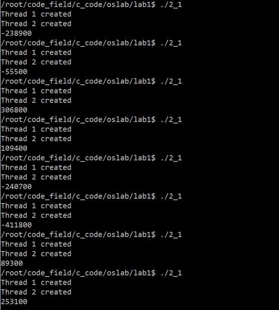
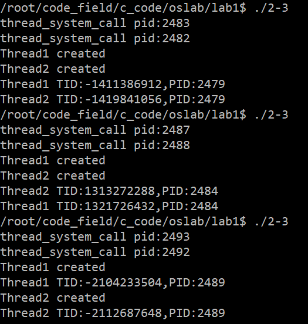

# 操作系统实验报告

# 实验一 进程、线程相关编程经验

# 1.2 线程相关编程实验

## 实验步骤

步骤一： 设计程序，创建两个子线程， 两线程分别对同一个共享变量多次操作，观察输出结果。

源代码如下：
```c
#include<stdio.h>
#include<pthread.h>

int res=0;

void *add(void *target){
    for(int i=0;i<100000;i++){
        res+=100;
    }
}

void *minus(void *target){
    for(int i=0;i<100000;i++){
        res-=100;
    }
}

int main(){
    pthread_t thread1,thread2;
    if(pthread_create(&thread1,NULL,add,&res)==0){
        printf("Thread 1 created\n");
    }
    if(pthread_create(&thread2,NULL,minus,&res)==0){
        printf("Thread 2 created\n");
    }
    pthread_join(thread1,NULL);
    pthread_join(thread2,NULL);
    printf("%d\n",res);
    return 0;
}
```

运行结果



可以发现，此时输出的结果并不并不固定。这是因为两个线程并发执行，对共享变量res读取到寄存器中时，读取到的是同一个值，一个线程要+100，一个线程要-100，本来效果应该是相互抵消的，但写回内存时，只将自己操作后的结果写回内存，此时就表现出+100或-100，导致值的改变。

考虑一个简单的情境：

1. **res** 当前值为 0。
2. 线程1 读取其值（0），准备加1。
3. 线程2 被调度，读取其值（还是0），准备减1。
4. 线程1 继续执行，将值加1，结果为1。
5. 线程2 继续执行，减1（认为之前的值是0），结果为 -1。

步骤二： 修改程序， 定义信号量 signal，使用 PV 操作实现共享变量的访问与互斥。运行程序，观察最终共享变量的值。

同步（Synchronization）在多线程编程中指的是协调多个线程的执行，以确保它们能够正常、可预测地访问共享资源或完成某些任务。互斥（Mutual Exclusion）是同步的一种特殊形式，确保一次只有一个线程能访问某个特定的资源或代码段。互斥通常通过互斥锁（Mutex）来实现，但它也可以通过其他机制来实现，比如信号量（Semaphore）。信号量和互斥锁类似，但更为通用。信号量可以用来解决除了互斥之外的其他同步问题。

PV操作是信号量（Semaphores）操作的传统术语，源自荷兰语的Proberen（尝试）和Verhogen（增加）。在信号量的上下文中，P操作通常用于申请或等待资源，而V操作用于释放或发出信号。

**P操作（也叫`wait`或`down`或`sem_wait`）**

- 当一个线程执行P操作时，它会检查信号量的值。
    - 如果信号量的值大于0，那么它将减少信号量的值（通常是减1）并继续执行。
    - 如果信号量的值为0，线程将被阻塞，直到信号量的值变为大于0。

**V操作（也叫`signal`或`up`或`sem_post`）**

- V操作增加信号量的值（通常是加1）。
- 如果有线程因执行P操作而阻塞在这个信号量上，一个或多个线程将被解除阻塞，并被允许减少信号量的值。

在C语言中，使用POSIX信号量

- **`sem_wait(&semaphore);`**：执行P操作。
- **`sem_post(&semaphore);`**：执行V操作。

其中，**`semaphore`**是一个**`sem_t`**类型的变量，代表信号量。

**`sem_init`**和**`sem_destroy`**是POSIX信号量（Semaphores）的初始化和销毁函数，它们用于设置和清理信号量。

**`sem_init`**

这个函数用于初始化一个未命名的信号量。

```c
int sem_init(sem_t *sem, int pshared, unsigned int value);
```

- **sem**: 一个指向信号量对象的指针。
- **pshared**: 如果这个参数是0，信号量就是当前进程的局部信号量。如果这个参数非0，则该信号量在多个进程间共享。
- **value**: 信号量的初始值。

这个函数成功时返回0，失败时返回-1。

**`sem_destroy`**

这个函数用于销毁一个未命名的信号量，释放其占用的资源。

```c
int sem_destroy(sem_t *sem);
```

- **sem**: 一个指向信号量对象的指针。

这个函数成功时返回0，失败时返回-1。在使用**`sem_destroy`**之前，确保没有线程被阻塞在该信号量上。

整体的代码为：

```c
#include<stdio.h>
#include<pthread.h>
#include<semaphore.h>

int res=0;
sem_t sem;

void *add(void *target){
    for(int i=0;i<100000;i++){
        sem_wait(&sem);
        res+=100;
        sem_post(&sem);
    }
}

void *minus(void *target){
    for(int i=0;i<100000;i++){
        sem_wait(&sem);
        res-=100;
        sem_post(&sem);
    }
}

int main(){
    pthread_t thread1,thread2;
    sem_init(&sem, 0, 1); // 初始化信号量，初始值为1，用于互斥

    if(pthread_create(&thread1,NULL,add,&res)==0){
        printf("Thread 1 created\n");
    }
    if(pthread_create(&thread2,NULL,minus,&res)==0){
        printf("Thread 2 created\n");
    }
    pthread_join(thread1,NULL);
    pthread_join(thread2,NULL);
    printf("%d\n",res);
    
    sem_destroy(&sem); // 销毁信号量
    return 0;
}
```
运行结果


可以看到用信号量同步之后，结果就是正确的，可预测的。

步骤三： 在第一部分实验了解了 system()与 exec 族函数的基础上，将这两个函数的调用改为在线程中实现，输出进程 PID 和线程的 TID 进行分析。

system_call程序源码
```c
#include<stdio.h>
#include <unistd.h>
#include <sys/types.h>

int main(){
    printf("thread_system_call pid:%d\n",getpid());
}
```

调用system的函数源码
```c
#include<stdio.h>
#include<pthread.h>
#include<stdlib.h>
#include <sys/types.h>

void* system_call(void* arg){
    int num=*((int*)arg);
    printf("Thread%d created\n",num);
    printf("Thread%d TID:%d, PID:%d\n",num,pthread_self(),getpid());
    system("/root/code_field/c_code/oslab/lab1/thread_system_call");
}

int main(){
    pthread_t thread1,thread2;
    int arg1=1,arg2=2;
    if(pthread_create(&thread1,NULL,system_call,&arg1)!=0){
        printf("Thread 1 creation failed\n");
    }
    if(pthread_create(&thread2,NULL,system_call,&arg2)!=0){
        printf("Thread 2 creation failed\n");
    }
    pthread_join(thread1,NULL);
    pthread_join(thread2,NULL);
}
```
运行结果



结果显示线程的TID不同，但都有一个相同的PID，也就是父进程的PID。
每一个线程的system调用都会创建一个新进程

应用exec族函数源码


```c
#include<stdio.h>   
#include<pthread.h>
#include<unistd.h>
#include<sys/types.h>

void* exec_call(void* arg){
    int num=*((int*)arg);
    fprintf(stderr,"Thread%d created\n",num);
    fprintf(stderr,"Thread%d TID:%d,PID:%d\n",num,pthread_self(),getpid());
    execl("/root/code_field/c_code/oslab/lab1/exec_call","exec_call",NULL);
    printf("if execl fails,this line will be printed\n");
}

int main(){
    pthread_t thread1,thread2;   
    int arg1=1,arg2=2;
    if(pthread_create(&thread1,NULL,exec_call,&arg1)!=0){
        printf("Thread 1 creation failed\n");
    }
    if(pthread_create(&thread2,NULL,exec_call,&arg2)!=0){
        printf("Thread 2 creation failed\n");
    }
    pthread_join(thread1,NULL);
    pthread_join(thread2,NULL);
    printf("if exec succeed,this will no be prinrfed");
}
```
运行结果


结果分析，父线程的最后一行的printf并没有执行，并且exec只有的代码实际上只执行了一遍，这是因为exec的调用实际上是进程级别的，调用exec会导致整个进程的代码段被替换，而不仅仅是当前线程执行的函数。