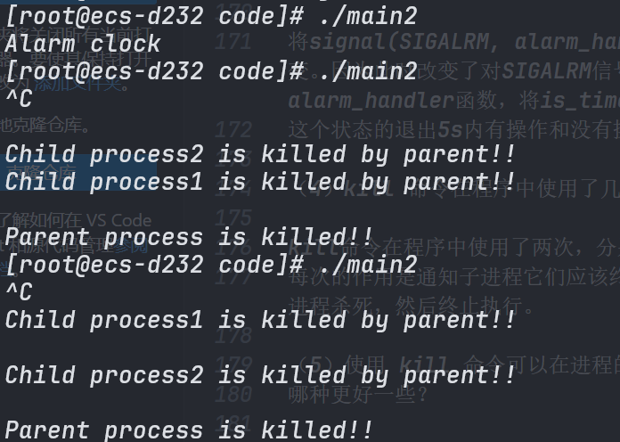
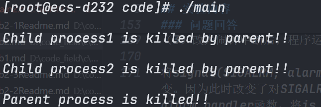
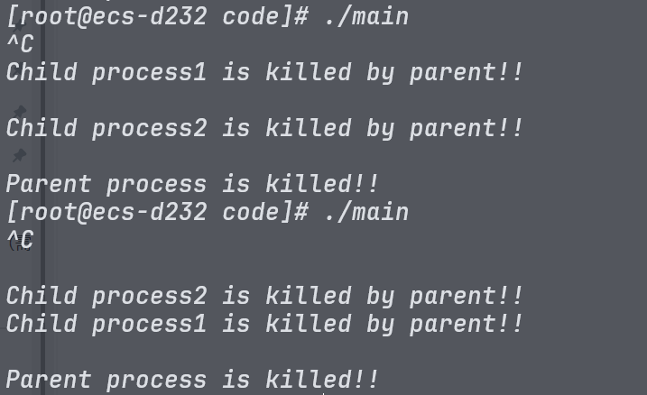
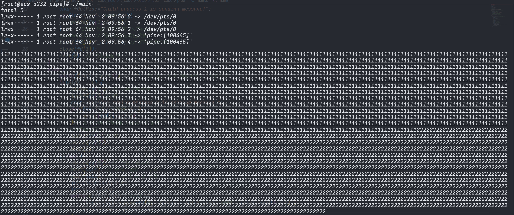
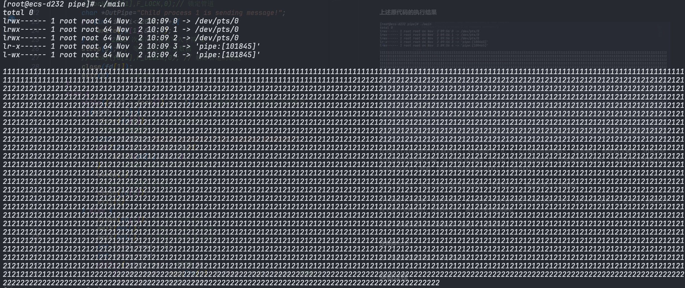
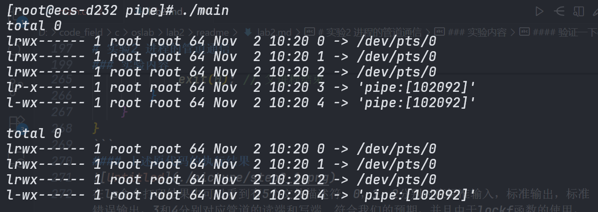

# 操作系统实验报告

# 实验1：进程的软中断通信

## 实验内容

（ 1）使用 man 命令查看 fork 、 kill 、 signal、 sleep、 exit 系统调用的帮助手册。

（ 2）根据流程图（如图 2.1 所示） 编制实现软中断通信的程序： 使用系统调用 fork()创建两个子进程，再用系统调用 signal()让父进程捕捉键盘上发出的中断信号（即 5s 内按下delete 键或 quit 键），当父进程接收到这两个软中断的某一个后，父进程用系统调用 kill()向两个子进程分别发出整数值为 16 和 17 软中断信号，子进程获得对应软中断信号，然后分别输出下列信息后终止：

Child process 1 is killed by parent !! Child process 2 is killed by parent !!

父进程调用 wait()函数等待两个子进程终止后，输出以下信息，结束进程执行： Parent process is killed!!

注： delete 会向进程发送 SIGINT 信号， quit 会向进程发送 SIGQUIT 信号。 ctrl+c 为delete， ctrl+\为 quit 。

（ 3）多次运行所写程序，比较 5s 内按下 Ctrl+\或 Ctrl+Delete 发送中断，或 5s 内不进行任何操作发送中断， 分别会出现什么结果？分析原因。

（ 4）将本实验中通信产生的中断通过 14 号信号值进行闹钟中断，体会不同中断的执行样式，从而对软中断机制有一个更好的理解

```c
#include <stdio.h>
#include <unistd.h>
#include <sys/wait.h>
#include <stdlib.h>
#include <signal.h>

int flag=0;
int is_timeout=0;
int child1_isready=0;
int child2_isready=0;

void inter_handler(int sig) {
 // TODO
    if(sig==SIGINT || sig==SIGQUIT){
        flag++;
    }
}

void alarm_handler(int sig) {
 // TODO
    if(sig==SIGALRM){
        is_timeout=1;
        flag=1;
    }
}

void child1_isready_handler(int sig) {
    if(sig==16){
        child1_isready=1;
    }
}

void child2_isready_handler(int sig) {
    if(sig==17){
        child2_isready=1;
    }
}

void waiting() {
 // TODO
    while(flag<1){
        pause();
    }
}

void child_handler(int sig) {
    if(sig==16){
        printf("\nChild process1 is killed by parent!!\n");
        exit(0);
    }
    if(sig==17){
        printf("\nChild process2 is killed by parent!!\n");
        exit(0);
    }
}

int main() {
    signal(SIGQUIT, inter_handler);
    signal(SIGINT, inter_handler);
    signal(SIGALRM, alarm_handler);
    signal(16, child1_isready_handler);
    signal(17, child2_isready_handler);

    // TODO: 五秒之后或接收到两个信号
    pid_t pid1=-1, pid2=-1;
    while (pid1 == -1)pid1=fork();
    if (pid1 > 0) {
        while (pid2 == -1)pid2=fork();
        if (pid2 > 0) {
            // TODO: 父进程
            alarm(5);
            waiting();
            alarm(0); 
            if(is_timeout){
                //printf("\nThe signal is timeout proc stopped auto!!\n");
            }
            while(!child1_isready){
                pause();
            }
            kill(pid1, 16);
            while(!child2_isready){
                pause();
            }
            kill(pid2, 17);
            wait(NULL);
            wait(NULL);
            
            printf("\nParent process is killed!!\n");
        } else {
            // TODO: 子进程 2
            kill(getppid(), 17);
            signal(17, child_handler);
            while(1){
                pause();
            }
        }
    } else {
        // TODO:子进程 1
        kill(getppid(), 16);
        signal(16, child_handler);
        while(1){
            pause();
        }
        printf("\nChild process1 is killed by parent!!\n");
        return 0;
    }
    return 0;
}
```

编写代码要考虑的问题：

(1)父进程向子进程发送信号时，如何确保子进程已经准备好接收信号？

(2)如何阻塞住子进程，让子进程等待父进程发来信号？

对于第一个问题，我设置了两个变量child1_isready和child2_isready，分别表示子进程1和子进程2是否已经准备好接收信号。子进程在启动时会向父进程发送一个信号，通知父进程它已经准备好了。在父进程中，将信号与signal函数绑定在一起，当他接受到某个子进程的信号后，就将相应进程的ready位设置为1.父进程在发送信号之前会检查这两个变量，确保子进程已经准备好。

对于第二个问题，我使用了pause函数来阻塞子进程。pause函数会使进程进入睡眠状态，直到接收到一个信号为止。子进程在启动后会调用pause函数，等待父进程发送信号。当父进程发送信号后，子进程会被唤醒并执行相应的信号处理函数。

### 代码解释
这份代码是有时钟中断的，如果要使程序没有时钟中断，只需要注释掉signnal(SIGALRM, alarm_handler);这一行即可。

flag变量用于记录父进程接收到的信号数量。当父进程接收到SIGINT或SIGQUIT信号时，inter_handler函数会将flag加1。当父进程接收到SIGALRM信号时，alarm_handler函数会将is_timeout设置为1，并将flag加1。

waiting函数会使父进程进入睡眠状态，直到flag的值大于等于1，即接收到至少一个信号为止。

在父进程中设置5秒的闹钟，如果在5秒内没有接收到任何信号，闹钟会触发SIGALRM信号，调用alarm_handler函数，将is_timeout设置为1，并将flag加1，从而使父进程退出等待状态。

如果接收到了SIGINT或SIGQUIT信号，父进程会退出waiting，并执行后续代码清除定时器，准备向子进程发送信号。

### 问题回答

（1）你最初认为运行结果会怎么样？写出你猜测的结果。

我最初认为两个进程会按照代码顺序那样，先杀死子进程1，再杀死子进程2。

（2）实际的结果什么样？有什么特点？在接收不同中断前后有什么差别？请将 5 秒内中断
和 5 秒后中断的运行结果截图，试对产生该现象的原因进行分析。

实际上，两个子进程的杀死顺序并不确定。并且如果5秒内有任何操作，父进程会向子进程发送信号，而如果五秒内没有任何操作，终端会输出"Alarm clock"。

原因分析：对于杀死顺序不确定这个问题，可能是因为编译代码时，两个kill的顺序并没有严格保证执行顺序，不过这个可能性比较低。
更可能的原因是父进程只负责发送信号，在发送信号后，子进程的执行顺序是由操作系统调度决定的，因此子进程1和子进程2被杀死的顺序是不确定的。

对于5s内中断和5秒后中断的区别：由于alarm信号没有被处理，因此当5秒内没有任何操作时，闹钟会触发SIGALRM信号，导致父进程退出等待状态，并输出"Alarm clock"。如果5秒内有任何操作，父进程会接收到SIGINT或SIGQUIT信号，正常向子进程发送信号。

（3）改为闹钟中断后，程序运行的结果是什么样子？与之前有什么不同？

将signal(SIGALRM, alarm_handler);取消注释后，程序运行结果并不因为5s内有无操作而改变。因为此时改变了对SIGALRM信号的处理方式，父进程在5秒后会接收到SIGALRM信号，并调用alarm_handler函数，将is_timeout设置为1，并将flag加1，使父进程退出waiting状态。
这个状态的退出5s内有操作和没有操作都是一样的。

（4）kill 命令在程序中使用了几次？每次的作用是什么？执行后的现象是什么？

kill命令在程序中使用了两次，分别用于向子进程1和子进程2发送信号。
每次的作用是通知子进程它们应该终止执行。执行后的现象是子进程会输出相应的消息，表示它们被父进程杀死，然后终止执行。

（5）使用 kill 命令可以在进程的外部杀死进程。进程怎样能主动退出？这两种退出方式
哪种更好一些？

进程可以通过调用exit函数来主动退出。exit函数会终止进程的执行，并返回一个状态码给操作系统。
这两种退出方式各有优缺点。使用kill命令可以在进程的外部强制终止进程，适用于需要立即停止进程的情况，但可能会导致资源未被正确释放。而主动调用exit函数可以确保进程有机会进行清理工作，释放资源，但可能需要更多的时间来完成退出过程。总体来说，主动退出更好一些，因为它允许进程有机会进行必要的清理工作。

### 运行结果截图







# 实验2 进程的管道通信

### 实验内容

（ 1）学习 man 命令的用法，通过它查看管道创建、同步互斥系统调用的在线帮助，并阅读参考资料。

（ 2）根据流程图（如图 2.2 所示）和所给管道通信程序，按照注释里的要求把代码补充完整，运行程序，体会互斥锁的作用，比较有锁和无锁程序的运行结果，分析管道通信是如何实现同步与互斥的。


基本代码

```c
/*管道通信实验程序残缺版 */ 
#include <unistd.h> 
#include <signal.h> 
#include <stdio.h> 
#include <stdlib.h>
int pid1,pid2; // 定义两个进程变量
int main(){
    int fd[2]; 
    char InPipe[5000]; // 定义读缓冲区
    char c1='1', c2='2'; 
    while(pipe(fd)==-1); // 创建管道
    FILE *fp;
    char buffer[1024];
    char command[100];
    sprintf(command, "ls -l /proc/%d/fd/", getpid());
    system(command);
    printf("\n");
    while((pid1 = fork( )) == -1); // 如果进程 1 创建不成功,则空循环
    if(pid1 == 0) { // 如果子进程 1 创建成功,pid1 为进程号
        close(fd[0]); // 关闭管道读端
        lockf(fd[1],F_LOCK,0);// 锁定管道
        char *OutPipe="Child process 1 is sending message!";
        for(int i=1;i<=2000;i++){
            write(fd[1],&c1,1);
        } // 分 2000 次每次向管道写入字符’1’ 
        sleep(3); // 等待读进程读出数据
        lockf(fd[1],F_ULOCK,0); // 解除管道的锁定
        close(fd[1]);
        exit(0); // 结束进程 1 
    } 
    else { 
        while((pid2 = fork()) == -1); // 若进程 2 创建不成功,则空循环
        if(pid2 == 0) { 
            close(fd[0]); // 关闭管道读端
            lockf(fd[1],1,0); 
            char *OutPipe="Child process 2 is sending message!";
            for(int i=1;i<=2000;i++){
                write(fd[1],&c2,1);
            }// 分 2000 次每次向管道写入字符’2’ 
            sleep(3); 
            lockf(fd[1],0,0); 
            close(fd[1]);
            exit(0); 
        } else { 
            close(fd[1]); // 关闭管道写端
            wait(NULL); // 等待子进程 1 结束
            wait(NULL); // 等待子进程 2 结束
            int total_read = 0;
            int bytes_read;
            while (total_read < 4000 && 
                (bytes_read = read(fd[0], InPipe + total_read, 4000 - total_read)) > 0) {
                total_read += bytes_read;
            }
            InPipe[total_read] = '\0';
            printf("%s\n",InPipe); // 显示读出的数据
            exit(0); // 父进程结束
        } 
    }
}
```
#### 上述原代码的执行结果

在ls命令打印结果中可以看到有5个文件描述符，0，1，2分别对应标准输入，标准输出，标准错误输出，3和4分别对应管道的读端和写端。符合我们的预期，并且由于lockf函数的使用，管道通信是互斥的，子进程1和子进程2不会同时向管道写入数据，因此读出的数据是2000个'1'后跟2000个'2'。

在这个程序中，我认为sleep是没有用处的，注释掉之后，输出结果与上述相同。

并且如果不考虑僵尸进程的风险，wait也是没有必要出现在while读取之前的，因为while循环在子进程写入数据的过程中是不会跳出的，注释掉之后，运行结果仍然相同。

上述三种情况是有lockf的情况，输出1，2是有序的。

#### 注释掉lockf
##### 第一种情况仍然保留了sleep和wait

可以看到输出结果是交错的，说明两个子进程在没有锁的情况下同时向管道写入数据，导致读出的数据是混乱的。
##### 注释掉sleep和wait，运行结果相同

#### 验证一下close的作用
在其中一个子进程中也调用打印当前进程文件描述符的命令，结果如下：

可见close函数的作用是关闭文件描述符，使得该文件描述符不再可用。

### 问题回答
(1)你最初认为运行结果会怎么样？

首先system命令会在终端打印当前进程的文件描述符情况，应该会有5个文件描述符，分别对应标准输入，标准输出，标准错误输出，管道的读端和写端。在有lockf情况下，我认为输出结果应该是2000个'1'后跟2000个'2'，因为lockf函数会确保两个子进程不会同时向管道写入数据。在没有lockf情况下，我认为输出结果可能是交错的'1'和'2'，因为两个子进程可能会同时向管道写入数据，导致读出的数据是混乱的。

(2)实际的结果什么样？有什么特点？试对产生该现象的原因进行分析。

实际运行结果与我的预期相符。在有lockf的情况下，输出结果是2000个'1'后跟2000个'2'，说明lockf函数成功地确保了两个子进程的互斥访问管道。在没有lockf的情况下，输出结果是交错的'1'和'2'，说明两个子进程确实同时向管道写入数据，导致读出的数据是混乱的。

(3)实验中管道通信是怎样实现同步与互斥的？如果不控制同步与互斥会发生什么后果？
管道通信通过lockf函数实现了同步与互斥。lockf函数用于锁定文件描述符，确保在一个进程写入数据时，其他进程无法访问该文件描述符，从而实现了互斥访问管道。如果不控制同步与互斥，多个进程可能会同时向管道写入数据，导致读出的数据是混乱的，无法正确地反映各个进程写入的数据内容。


# 实验三 内存的分配与回收
### 实验过程

- **First Fit (FF)**

    算法思想

    在 First Fit 算法中，分配器会扫描空闲块列表，找到第一个足够大的空闲块，并将其分配出去。如果该空闲块大于请求的内存，则会分割该块。

    优缺点

    - **优点**: 查找速度相对较快，因为一旦找到合适的空闲块，立即停止搜索。
    - **缺点**: 容易导致内存碎片，特别是外部碎片。

    提高查找性能

    在本次实验中好像并无。

- **Best Fit (BF)**

    算法思想

    Best Fit 算法在所有的空闲块中找到与请求最匹配（即最接近）的空闲块。这通常需要扫描整个空闲块列表。

    优缺点

    - **优点**: 最小化了每次分配后的剩余空间，从而减少了浪费。
    - **缺点**: 查找性能较差，因为通常需要扫描整个列表；可能导致更多小的空闲块，进而增加碎片。

    提高查找性能

    维护一个按照大小排序的空闲块列表来提高查找性能。

- **Worst Fit (WF)**

    算法思想

    Worst Fit 算法选择最大的可用空闲块进行分配，假设剩下的空间可能更有用。

    优缺点

    - **优点**: 理论上，选择最大的空闲块应该能减少碎片。
    - **缺点**: 在实践中，通常并不比其他算法好，查找性能也通常是最差的。

    提高查找性能

    维护一个按大小排序的空闲块列表来提高查找性能。

对于FF的空闲块排序（事实上是不需要排序的，因为无论如何排列，只要找到第一个可用的就行），对于BF、WF我采用了相同的排序算法――归并排序，这是一种稳定的且速度极快的排序算法，对于提升内存分配速率有很大作用。

- 内碎片

    由于我们对于最小碎片长度有要求，一个空闲块的大小enough但是并不sufficient。比如在我们的实验中最小的碎片长度为10，一个空闲块大小为28，现在要给他分配一个20大小的proc，只能剩下8，如果被切出，不符合要求，因此28要一次性分配给proc。（此时proc的size是否应该保持为request_size（20）而不是28？我个人认为要记录为28，无论这8个空间是否被proc使用，但是其所“占用”的就是这么大，对于其他proc的影响也是这么大）

- 外碎片

    由于我们的多次申请空间释放空间导致的长度小于最小值的碎片。例如经过一系列行为，导致701―705的空间为free的，但是显然这部分空间永远无法被使用到。

    内存紧缩解决的就是这种碎片。

- 回收内存时。空闲块合并主要是通过insertion sort实现，根据空闲块的地址排序，如果空闲块的内存是连续的，那就将其合并为一个块。


代码实现：

```c
#include <stdio.h>
#include <stdlib.h>

#define PROCESS_NAME_LEN 32
#define MIN_SLICE 10
#define DEFAULT_MEM_SIZE 1024
#define DEFAULT_MEM_START 0

#define MA_FF 1
#define MA_BF 2
#define MA_WF 3

#include "2.3.h"

struct free_block_type {
  int size;
  int start_addr;
  struct free_block_type *next;
};
struct free_block_type *free_block = NULL;

struct allocated_block {
  int pid;
  int size;
  int start_addr;
  char process_name[PROCESS_NAME_LEN];
  struct allocated_block *next;
};
struct allocated_block *allocated_block_head = NULL;

int allocate_mem(struct allocated_block *ab);
void kill_process();
struct allocated_block *find_process(int pid);
void free_mem(struct allocated_block *ab);
void dispose(struct allocated_block *free_ab);
void kill_block(struct allocated_block *ab);
void display_mem_usage();
void set_mem_size();
void set_algorithm();
void display_menu();
void new_process();
void rearrange(int algorithm);
void sort_free_blocks();
void compact();
void memory_compaction();
void do_exit();
int mem_size = DEFAULT_MEM_SIZE;
int ma_algorithm = MA_FF;
static int pid = 0;
int flag = 0;

struct free_block_type *init_free_block(int mem_size) {
  struct free_block_type *fb;
  fb = (struct free_block_type *)malloc(sizeof(struct free_block_type));
  if (fb == NULL) {
    printf("No mem\n");
    return NULL;
  }
  fb->size = mem_size;
  fb->start_addr = DEFAULT_MEM_START;
  fb->next = NULL;
  return fb;
}

void set_mem_size() {
  int size;
  if (flag != 0) {
    printf("Cannot set memory size again\n");
    return;
  }
  printf("set memory_size to: ");
  scanf("%d", &size);
  if (size > 0) {
    mem_size = size;
    free_block->size = mem_size;
  }
  flag = 1;
}

void set_algorithm() {
  int algorithm;
  printf("\t1 - First Fit\n");
  printf("\t2 - Best Fit \n");
  printf("\t3 - Worst Fit \n");
  scanf("%d", &algorithm);
  if (algorithm >= MA_FF && algorithm <= MA_WF) {
    ma_algorithm = algorithm;
  }
  rearrange(ma_algorithm);
}

struct free_block_type *merge(struct free_block_type *a,
                              struct free_block_type *b, int criterion) {
  struct free_block_type dummy;
  struct free_block_type *current = &dummy;
  if (criterion == MA_BF) {
    while (a && b) {
      if (a->size < b->size) {
        current->next = a;
        a = a->next;
      } else {
        current->next = b;
        b = b->next;
      }
      current = current->next;
    }
    current->next = a ? a : b;
  } else if (criterion == MA_WF) {
    while (a && b) {
      if (a->size > b->size) {
        current->next = a;
        a = a->next;
      } else {
        current->next = b;
        b = b->next;
      }
      current = current->next;
    }
    current->next = a ? a : b;
  }
  return dummy.next;
}
struct free_block_type *mergeSort(struct free_block_type *head, int criterion) {
  if (!head || !head->next) return head;

  struct free_block_type *a = head, *b = head->next;
  while (b && b->next) {
    head = head->next;
    b = b->next->next;
  }
  b = head->next;
  head->next = NULL;

  return merge(mergeSort(a, criterion), mergeSort(b, criterion), criterion);
}

void rearrange_FF() { return; }
void rearrange_BF() { free_block = mergeSort(free_block, MA_BF); }
void rearrange_WF() { free_block = mergeSort(free_block, MA_WF); }
void rearrange(int algorithm) {
  switch (algorithm) {
    case MA_FF:
      rearrange_FF();
      break;
    case MA_BF:
      rearrange_BF();
      break;
    case MA_WF:
      rearrange_WF();
      break;
    default:
      printf("Invalid algorithm.\n");
  }
}

void sort_free_blocks() {
  // insertion sort
  struct free_block_type *current, *next, *tmp, *pre;

  if (!free_block || !free_block->next) return;

  current = free_block->next;
  free_block->next = NULL;

  while (current) {
    pre = NULL;
    next = current->next;

    tmp = free_block;
    while (tmp->next && tmp->next->start_addr < current->start_addr) {
      pre = tmp;
      tmp = tmp->next;
    }
    if (!pre) {
      current->next = free_block;
      free_block = current;
    } else {
      current->next = pre->next;
      pre->next = current;
    }
    current = next;
  }
}

int allocate_mem(struct allocated_block *ab) {
  struct free_block_type *fb, *pre;
  int request_size = ab->size;
  fb = pre = free_block;
  int total_free_size = 0;
  // 根据当前算法在空闲分区链表中搜索合适空闲分区进行分配，分配时注意以下情况：
  while (fb) {
    if (fb->size - request_size >= MIN_SLICE) {
      //  1. 找到可满足空闲分区且分配后剩余空间足够大，则分割
      ab->start_addr = fb->start_addr;
      ab->size = request_size;
      fb->start_addr += request_size;
      fb->size -= request_size;
      goto success;
    } else if (fb->size >= request_size) {
      //  2. 找到可满足空闲分区且但分配后剩余空间比较小，则一起分配
      ab->start_addr = fb->start_addr;
      ab->size = fb->size;
      pre->next = fb->next;
      free(fb);
      goto success;
    } else {
      total_free_size += fb->size;
      pre = fb;
      fb = fb->next;
    }
  }
  if (total_free_size >= request_size) {
    memory_compaction();
    //  3.
    //  找不可满足需要的空闲分区但空闲分区之和能满足需要，则采用内存紧缩技术，进行空闲分区的合并，然后再分配
    fb = pre = free_block;
    while (fb) {
      if (fb->size - request_size >= MIN_SLICE) {
        ab->start_addr = fb->start_addr;
        ab->size = request_size;
        fb->start_addr += request_size;
        fb->size -= request_size;
        goto success;
      } else if (fb->size >= request_size) {
        ab->start_addr = fb->start_addr;
        ab->size = fb->size;
        pre->next = fb->next;
        free(fb);
        goto success;
      } else {
        pre = fb;
        fb = fb->next;
      }
    }
  }
  return -1;

success:
  rearrange(ma_algorithm);
  return 1;
  //  4. 在成功分配内存后，应保持空闲分区按照相应算法有序
  //  5. 分配成功则返回1，否则返回-1
}
void memory_compaction() {
  // Step 1: 将所有已分配的块移动到内存的起始地址
  int new_start_addr = 0;
  struct allocated_block *cur = allocated_block_head;
  while (cur) {
    cur->start_addr = new_start_addr;
    new_start_addr += cur->size;
    cur = cur->next;
  }
  // Step 2: 释放所有旧的空闲块
  struct free_block_type *fb = free_block;
  while (fb) {
    struct free_block_type *tmp = fb;
    fb = fb->next;
    free(tmp);
  }

  // Step 3: 创建一个新的空闲块，其起始地址为最后一个已分配块的结束地址
  free_block = (struct free_block_type *)malloc(sizeof(struct free_block_type));
  free_block->start_addr = new_start_addr;
  free_block->size = mem_size - new_start_addr;
  free_block->next = NULL;
}

void new_process() {
  struct allocated_block *ab;
  int size;
  int ret;
  ab = (struct allocated_block *)malloc(sizeof(struct allocated_block));
  if (!ab) exit(-5);
  ab->next = NULL;
  pid++;
  sprintf(ab->process_name, "PROCESS-%02d", pid);
  ab->pid = pid;
  printf("Memory for %s: ", ab->process_name);
  scanf("%d", &size);
  if (size > 0) ab->size = size;
  ret = allocate_mem(ab);
  if ((ret == 1) && (allocated_block_head == NULL)) {
    allocated_block_head = ab;
  } else if (ret == 1) {
    ab->next = allocated_block_head;
    allocated_block_head = ab;
  } else if (ret == -1) {
    printf("Allocation fail\n");
    free(ab);
  }
}

void kill_process() {
  struct allocated_block *ab;
  int pid;
  printf("Kill Process, pid=");
  scanf("%d", &pid);
  ab = find_process(pid);
  if (ab != NULL) {
    free_mem(ab); /*释放ab所表示的分配区*/
    dispose(ab);  /*释放ab数据结构节点*/
  }
}
void free_mem(struct allocated_block *ab) {
  int algorithm = ma_algorithm;
  struct free_block_type *fb;
  fb = (struct free_block_type *)malloc(sizeof(struct free_block_type));
  if (!fb) {
    printf("malloc fail in free_mem\n");
    return;
  }
  fb->size = ab->size;
  fb->start_addr = ab->start_addr;
  fb->next = free_block;
  free_block = fb;
  sort_free_blocks();
  compact();
  rearrange(ma_algorithm);
  // 进行可能的合并，基本策略如下
  // 1. 将新释放的结点插入到空闲分区队列末尾 I choose the head not end.
  // 2. 对空闲链表按照地址有序排列
  // 3. 检查并合并相邻的空闲分区
  // 4. 将空闲链表重新按照当前算法排序
}
void dispose(struct allocated_block *free_ab) {
  struct allocated_block *pre, *ab;
  if (free_ab == allocated_block_head) { /*如果要释放第一个节点*/
    allocated_block_head = allocated_block_head->next;
    free(free_ab);
    return;
  }
  pre = allocated_block_head;
  ab = allocated_block_head->next;
  while (ab != free_ab) {
    pre = ab;
    ab = ab->next;
  }
  pre->next = ab->next;
  free(ab);
}

void compact() {
  struct free_block_type *fb = free_block;
  struct free_block_type *next = NULL;

  while (fb && fb->next) {
    next = fb->next;
    if (fb->start_addr + fb->size == next->start_addr) {
      fb->size += next->size;
      fb->next = next->next;
      free(next);
    } else {
      fb = fb->next;
    }
  }
}

struct allocated_block *find_process(int pid) {
  struct allocated_block *ab = allocated_block_head;
  while (ab != NULL) {
    if (ab->pid == pid) {
      return ab;
    }
    ab = ab->next;
  }
  return NULL;
}

void kill_block(struct allocated_block *ab) {
  struct allocated_block *pre_ab = allocated_block_head;
  if (ab == allocated_block_head) {
    allocated_block_head = ab->next;
    free(ab);
    return;
  }
  while (pre_ab) {
    if (pre_ab->next == ab) {
      pre_ab->next = ab->next;
      free(ab);
      return;
    }
    pre_ab = pre_ab->next;
  }
}

void display_mem_usage() {
  struct free_block_type *fbt = free_block;
  struct allocated_block *ab = allocated_block_head;

  if (fbt == NULL) {
    printf("No free memory blocks\n");
    return;
  }

  printf("----------------------------------------------------------\n");
  printf("Free Memory:\n");
  printf("%20s %20s\n", "start_addr", "size");
  while (fbt != NULL) {
    printf("%20d %20d\n", fbt->start_addr, fbt->size);
    fbt = fbt->next;
  }
  printf("\nUsed Memory:\n");
  printf("%10s %20s %10s %10s\n", "PID", "ProcessName", "start_addr", "size");
  while (ab != NULL) {
    printf("%10d %20s %10d %10d\n", ab->pid, ab->process_name, ab->start_addr,
           ab->size);
    ab = ab->next;
  }

  printf("----------------------------------------------------------\n");
}

int main() {
  char choice;
  pid = 0;
  free_block = init_free_block(mem_size);  // 初始化空闲区
  while (1) {
    display_menu();
    fflush(stdin);
    choice = getchar();
    switch (choice) {
      case '1':
        set_mem_size();
        break;
      case '2':
        set_algorithm();
        flag = 1;
        break;
      case '3':
        new_process();
        flag = 1;
        break;
      case '4':
        kill_process();
        flag = 1;
        break;
      case '5':
        display_mem_usage();
        flag = 1;
        break;
      case '0':
        do_exit();
        exit(0);
      default:
        break;
    }
  }
}

void display_menu() {
  printf("\n");
  printf("1 - Set memory size (default=%d)\n", DEFAULT_MEM_SIZE);
  printf("2 - Select memory allocation algorithm\n");
  printf("3 - New process \n");
  printf("4 - Terminate a process \n");
  printf("5 - Display memory usage \n");
  printf("0 - Exit\n");
}

void do_exit() {
  struct allocated_block *ab = allocated_block_head;
  while (ab) {
    allocated_block_head = ab->next;
    free(ab);
    ab = allocated_block_head;
  }
  struct free_block_type *fb = free_block;
  while (fb) {
    free_block = fb->next;
    free(fb);
    fb = free_block;
  }
}
```

